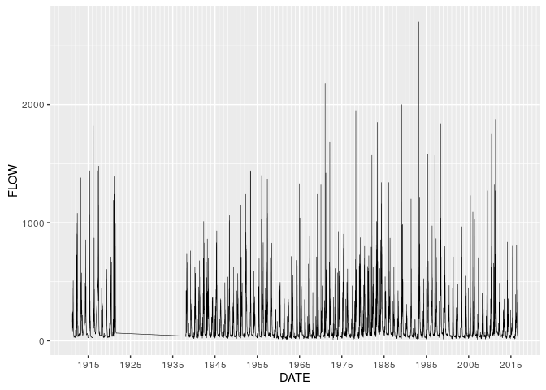
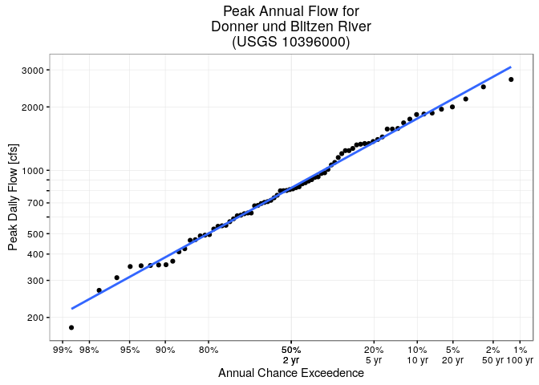
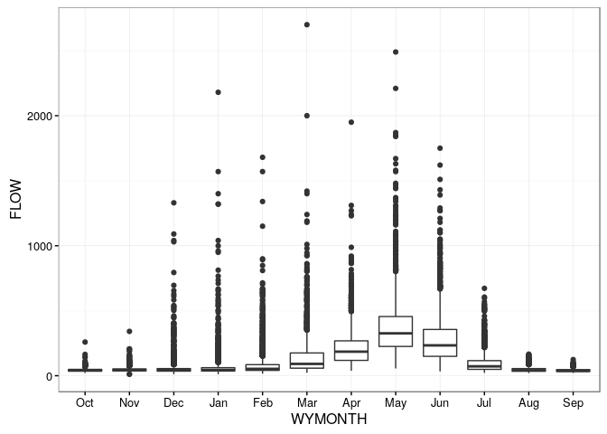
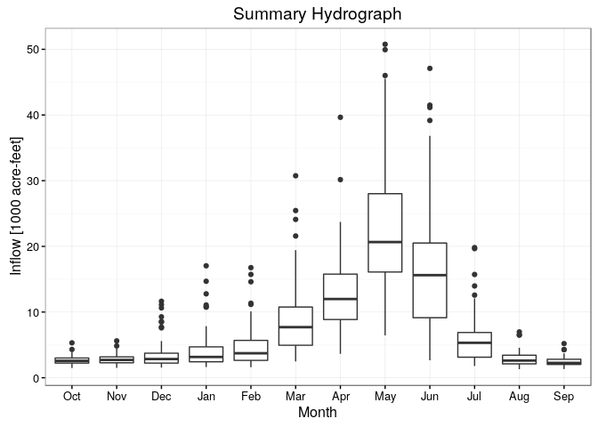
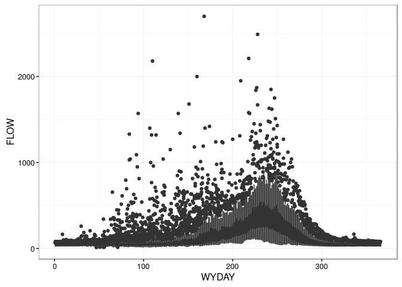
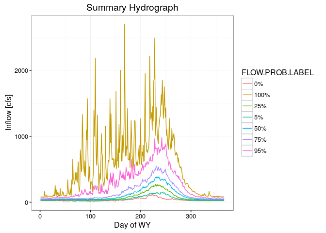

# HydroUtils Examples

This is a short example of some of the tools included in the `hydroutils` package.


```r
require(stringr)
```

```
## Loading required package: stringr
```

```r
require(hydroutils)
```

```
## Loading required package: hydroutils
```

```r
require(dataRetrieval)
```

```
## Loading required package: dataRetrieval
```

```r
require(ggplot2)
```

```
## Loading required package: ggplot2
```

```r
require(scales)
```

```
## Loading required package: scales
```

```r
require(reshape2)
```

```
## Loading required package: reshape2
```

```r
require(plyr)
```

```
## Loading required package: plyr
```

## Flow Frequency Curve Hydrograph
Essentially a cumulative frequency distribution plot, showing flow on a log scale against a annual chance of exceedance on a probability (normal) scale.  This is a commonly used plot in hydrology, with the methods in Bulletin 17B used for determining the 100-year flood by fitting a log-normal distribution to the data plotted.

The Donner und Blitzen River is in a rural part of southeast Oregon and flows into a closed basin.


```r
# read Donner und Blitzen river daily flows from USGS National Water Information System
rawDonnerUndBlitzen = readNWISdv("10396000", "00060")
rawDonnerUndBlitzen = rawDonnerUndBlitzen[,3:4] # being bad and ignoring the quality codes.
colnames(rawDonnerUndBlitzen) = c("DATE", "FLOW")

# plot data to see what we have
ggplot(rawDonnerUndBlitzen) + geom_line(aes(x=DATE, y=FLOW), size=0.2) + 
  scale_x_date(breaks=date_breaks("10 year"), date_labels="%Y", minor_breaks=date_breaks("1 year"))
```

<!-- -->


```r
# subset only to full WY in recent record
donnerUndBlitzen = subset(rawDonnerUndBlitzen, wateryear(DATE) >= 1937 & wateryear(DATE) < 2016) # use only 
```

```
## Loading required package: lubridate
```

```
## 
## Attaching package: 'lubridate'
```

```
## The following object is masked from 'package:plyr':
## 
##     here
```

```
## The following object is masked from 'package:base':
## 
##     date
```

```r
# use hydroutils date functions to get water year (starts Oct 1)
donnerUndBlitzen$WY = wateryear(donnerUndBlitzen$DATE)
# let's add the day of water year (oct1 = 1, Sept30 = 365 or 366)
donnerUndBlitzen$WYDAY = wyday(donnerUndBlitzen$DATE)
# and the month of WY, Oct=1, Sept=12
donnerUndBlitzen$WYMONTH = factor(wymonth.abb[wymonth(donnerUndBlitzen$DATE)], levels=wymonth.abb)
```


```r
# calculate peak flows
flowPeaks = ddply(donnerUndBlitzen, .(WY), summarize, 
                  PEAK.FLOW=max(FLOW))
# calculate weibull plotting position = rank(peak Q)/(n+1)
flowPeaks$PROB = weibullProbs(flowPeaks$PEAK.FLOW)
ggplot(flowPeaks, aes(x=PROB, y=PEAK.FLOW)) + geom_point() + 
  theme_bw(base_size=11) + theme(legend.position = "bottom", panel.grid.minor=element_blank()) +
  scale_y_continuous(trans=hydro_flow_trans(), name="Peak Daily Flow [cfs]") + 
  scale_x_continuous(trans=hydro_prob_trans(lines=c(1,2,5), labels=c(1,2,5), byPeriod=TRUE), 
                     name="Annual Chance Exceedence") +
  ggtitle("Peak Annual Flow for\nDonner und Blitzen River\n(USGS 10396000)") +
  stat_smooth(method="lm", se=FALSE)
```

```
## Warning in probBreaks(maxLevel = magnitude, ...): Generating breaks with
## reoccurance periods shown - You shouldn't be using '-year' events!

## Warning in probBreaks(maxLevel = magnitude, ...): Generating breaks with
## reoccurance periods shown - You shouldn't be using '-year' events!

## Warning in probBreaks(maxLevel = magnitude, ...): Generating breaks with
## reoccurance periods shown - You shouldn't be using '-year' events!
```

<!-- -->

## Summary Hydrograph example: Donner und Blitzen River near Frenchglen, OR
A summmary hydrograph is another common plot used in hydrology to help understand what part of the year the majority of a river's runoff will occur.  Typically it takes the form of lines connecting quantiles of flow across different time intervals, either on a daily or monthly scale.  Below are two examples of crude-in-progress plots (1 and 3) and two examples of cleaned up plots (2 and 4) showing the data in a slightly better manner.


```r
# plot summary hydrograph by month - this this is much faster
ggplot(donnerUndBlitzen) + theme_bw() + 
  geom_boxplot(aes(x=WYMONTH, y=FLOW, group=WYMONTH))
```

<!-- -->

```r
# do it right, monthly flow volumes
donnerUndBlitzenMonthly = ddply(donnerUndBlitzen, .(WY, WYMONTH), summarize, MON.FLOW=sum(FLOW)*AF_PER_CFS_DAY/1000) # sum up cfs-day convert to acre-feet
ggplot(donnerUndBlitzenMonthly) + theme_bw() + 
  geom_boxplot(aes(x=WYMONTH, y=MON.FLOW, group=WYMONTH)) + 
  xlab("Month") + ylab("Inflow [1000 acre-feet]") + ggtitle("Summary Hydrograph")
```

<!-- -->

```r
# plot summary hydrograph by day - this is much slower because we're plotting 366 boxplots.
ggplot(donnerUndBlitzen) + theme_bw() + 
  geom_boxplot(aes(x=WYDAY, y=FLOW, group=WYDAY))
```

<!-- -->

```r
# convert to quantiles
FLOW.PROB=c(0, 0.05, 0.25, 0.5, 0.75, 0.95, 1)
donnerUndBlitzenSummary = ddply(donnerUndBlitzen, .(WYDAY), summarize, 
                                FLOW.PROB.LABEL=paste0(as.character(100*FLOW.PROB), "%"),
                                FLOW=quantile(FLOW, probs=FLOW.PROB))
ggplot(donnerUndBlitzenSummary) + 
  geom_line(aes(x=WYDAY, y=FLOW, group=FLOW.PROB.LABEL, color=FLOW.PROB.LABEL)) +
  xlab("Day of WY") + ylab("Inflow [cfs]") + ggtitle("Summary Hydrograph")
```

<!-- -->
